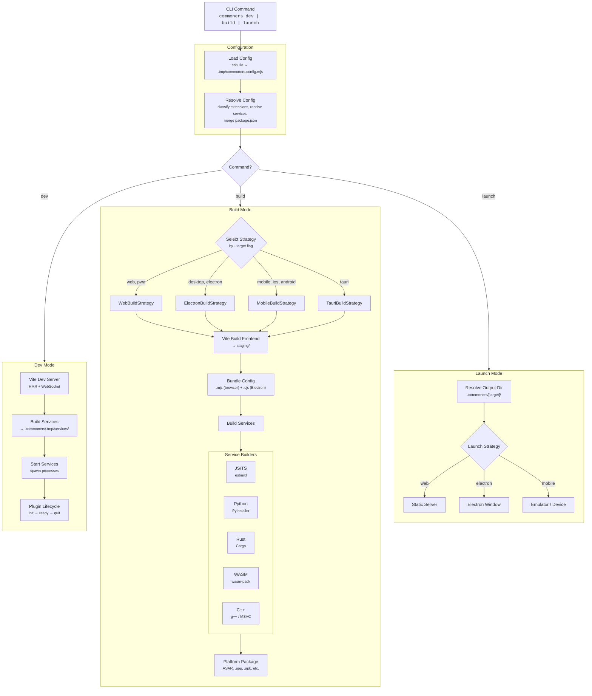
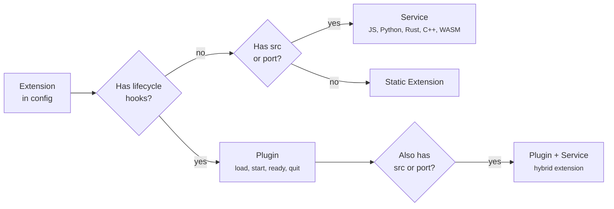

# Architecture

Commoners is an orchestration layer. It reads a single `commoners.config.ts` and delegates to specialized tools — Vite for bundling, Electron for desktop, Capacitor for mobile — while managing services, plugins, and platform differences.

## How a Command Flows



## Config Bundling

The config is bundled **three ways** to strip sensitive or irrelevant data per target:

| Bundle | Format | Includes | Strips | Used By |
|--------|--------|----------|--------|---------|
| **Node.js** | Full ESM | Everything | Nothing | Config resolution (build time) |
| **Browser** (`.mjs`) | ESM | `plugins` | Service `src`, `port`, `build`, `env` | Frontend runtime |
| **Electron** (`.cjs`) | CJS | `name`, `icon`, `electron`, `plugins`, `services`, `hooks` | Browser-only props | Electron main process |

This ensures service source code and environment variables never leak into browser bundles.

## Extensions System

Plugins and services are unified under `config.extensions`. Each extension is automatically classified:



At runtime, `commoners.SERVICES` provides URLs and `commoners.READY` resolves plugin APIs. Your frontend code doesn't need to know whether a service runs locally (desktop) or remotely (web/mobile).

## Build Strategies

The build system uses the Strategy pattern. Each target registers a build strategy and a launch strategy:

| Target | Build Strategy | Launch Strategy | Runtime |
|--------|---------------|----------------|---------|
| `web` | WebBuildStrategy | Static server | Browser |
| `pwa` | WebBuildStrategy | Static server | Browser + SW |
| `electron` / `desktop` | ElectronBuildStrategy | Electron window | Chromium + Node.js |
| `tauri` | TauriBuildStrategy | Tauri window | System webview + Rust |
| `ios` / `android` / `mobile` | MobileBuildStrategy | Capacitor CLI | Native webview |

New targets can be added by registering a strategy with `BuildFlow.registerStrategy()`.

## Directory Layout

```
my-app/
├── commoners.config.ts          ← single source of truth
├── src/                         ← your frontend code
├── .commoners/                  ← generated (gitignored)
│   ├── .tmp/                    ← dev mode artifacts
│   │   ├── commoners.config.mjs ← loaded config
│   │   └── services/            ← dev service binaries
│   ├── services/                ← production service binaries
│   ├── electron/                ← Electron build output
│   ├── web/                     ← web build output
│   └── mobile/                  ← Capacitor project
```
